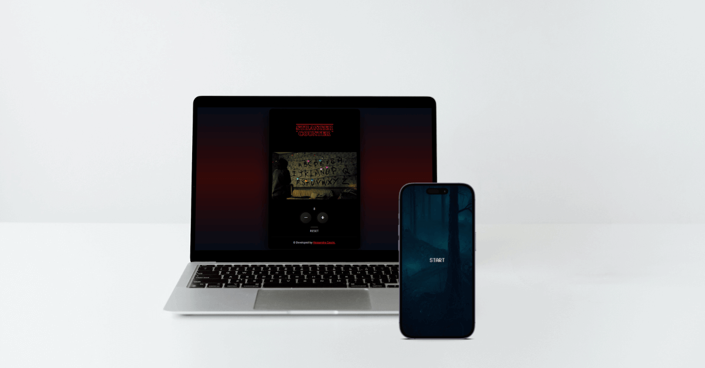

<h3 align="center">Stranger Counter</h3>

A simple counter application inspired by Stranger Things.
   
  <a href="https://stranger-counter.netlify.app/"><strong>View Demo »</strong></a>

<!-- TABLE OF CONTENTS -->

  
Table of Contents

  <ol>
    <li>
      <a href="#overview">Overview</a>
      <ul>
        <li><a href="#about-the-project">About The Project</a></li>
        <li><a href="#links">Links</a></li>
      </ul>
    </li>
    <li>
      <a href="#my-process">My Process</a>
      <ul>
        <li><a href="#built-with">Built With</a></li>
      </ul>
    </li>
    <li><a href="#author">Author</a></li>
  </ol>

## Overview

### About the project

This is the second project carried out during the start2impact University course in Front End Development. 

It consists of creating a JavaScript application that works as a counter and to give the user a more original experience, I took inspiration from Stranger Things.

Users should be able to: increase and decrease the value of the counter by playing with the lights of the Byers' house as if they were Will and resetting the counter hearing the verse of the Demogorgon, then ... you just have to try!

### Links

- Solution URL: https://github.com/alessandra-casole/stranger-counter
- Live Site URL: https://stranger-counter.netlify.app/

## My process

### Built with

- Semantic HTML5 markup
- CSS custom properties
- Mobile-first workflow
- Flexbox
- Media Query
- JavaScript

## Author

- <a href="https://www.alessandracasole-dev.com">Alessandra Casole</a>

